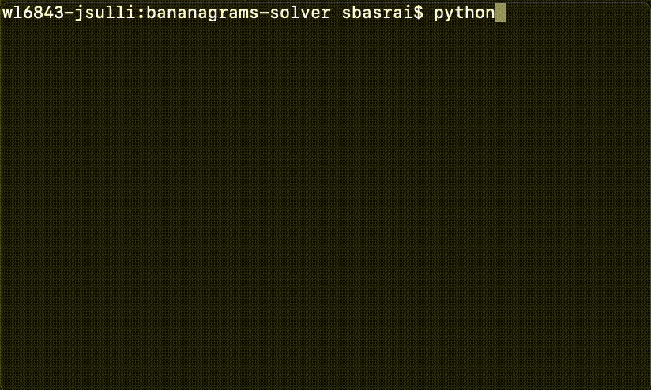
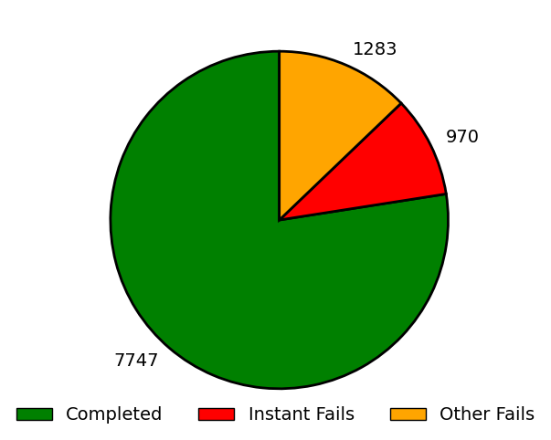
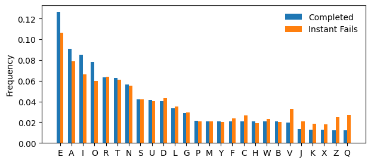
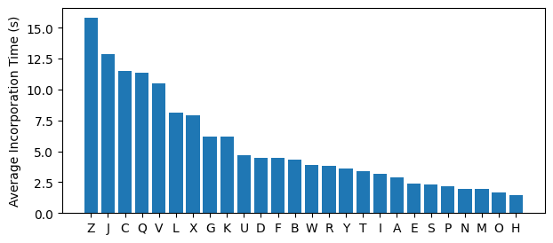
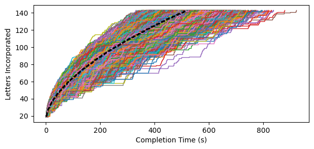
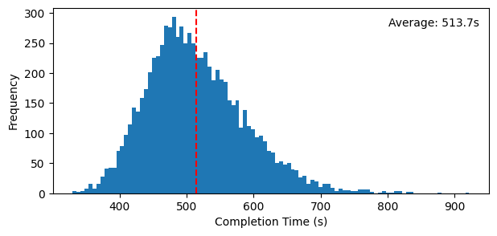

# Bananagrams Solver

BGSolver plays the word game [Bananagrams](https://en.wikipedia.org/wiki/Bananagrams).

<!--  -->

It was originally designed for a competition in which players move the tiles in real life but use their programs to dictate their moves. Thus, it offers you opportunities to cancel reorder attempts (if, for example, your opponent has called "peel" and you would like to enter a new letter). There are 3 game modes:

1. `python3 main.py` \
The user inputs letters manually. When asked if you would like to continue, hit enter (empty string) for yes, and any key + enter for no.

2. `python3 main.py -auto` \
Letters are randomly drawn without replacement from the set of 144 letters in the original game. The program will either complete the game (about 77.5% of the time, see analysis below) or get stuck in an infinite loop due to a hard scramble (no "dumps" allowed!).

3. `python3 main.py -infinite` \
Letters are randomly drawn with replacement indefinitely. It will take longer to make words as the board gets larger.

## Insights from 10,000 games of Bananagrams

I ran BGSolver 10,000 times (with `-auto`) and logged all the details of each run.

It can complete the game about 77.5% of the time but gets stuck in the remaining cases. In Bananagrams, the player starts with an intial set of 21 letters (or fewer, if there are more players). An "instant fail" refers to the case where BGSolver is unable to resolve the board using the initial 21 letters (9.7% of runs). "Other fails" means it got past the initial 21 but ended up getting stuck somewhere else along the way.

To understand why this happens, let's look at the letter distribution for the first 21 letters in "Completed" vs. "Instant Fails".

The "instant fail" runs are depleted of vowels (E, A, I, O) and enriched for the most difficult letters (V, J, K, X, Z, Q). As one might expect, the dynamics of a word game are driven by the interplay of vowels and consonants (especially the hard ones) available to the player. We can see this again when considering the average incorporation time (i.e., how long BGSolver takes to fit the letter into the board) for each letter across all 10,000 runs:

Interestingly, C ranks in third place for longest incorporation time.

Total completion times for the "Completed" runs:

They seem to follow a gamma distribution with an average completion time of 513.7 seconds. This will naturally vary depending on the hardware used. When BGSolver gets stuck, it iteratively tries to break words one at a time and resolve the board. Runtime could easily be improved by simply breaking the whole board and starting from scratch every time it gets stuck. However, this would defeat the original purpose of the program, namely, to dictate moves to a human player moving the tiles in real life. Breaking the whole board and starting over would be extremely time consuming and the opponent would probably win.