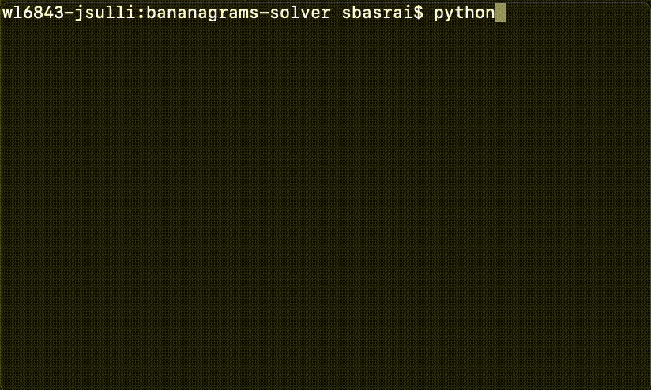
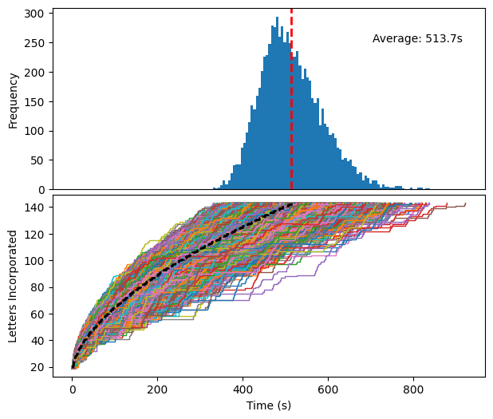
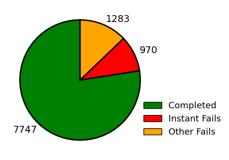
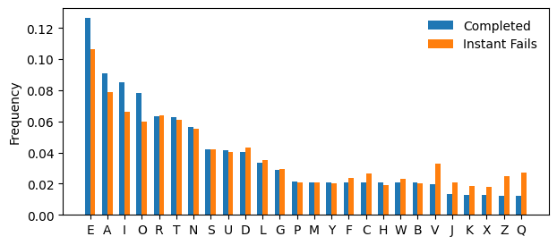
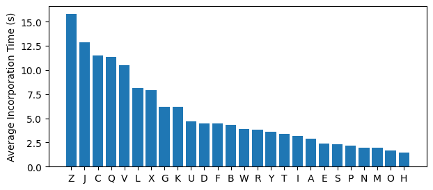
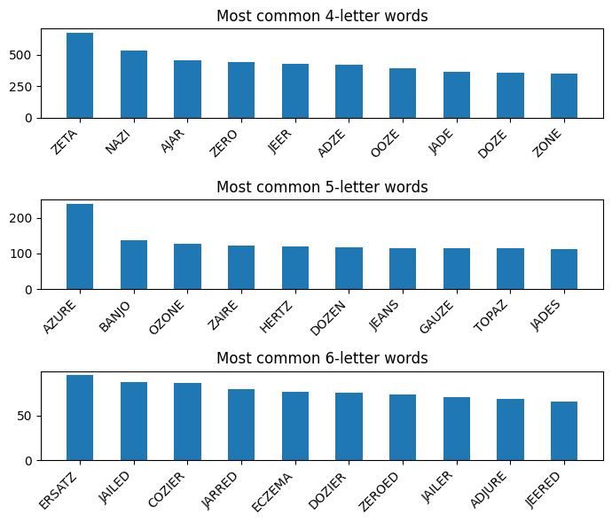
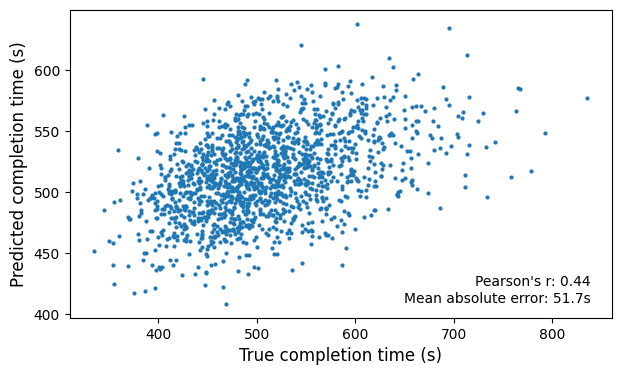

# Bananagrams Solver
BGSolver plays the word game [Bananagrams](https://en.wikipedia.org/wiki/Bananagrams). 



It was originally designed for a competition in which players move the tiles in real life but use their programs to dictate their moves. Thus, it offers you opportunities to cancel reorder attempts (if, for example, your opponent has called "peel" and you would like to enter a new letter). There are 2 game modes:

1. **Manual** \
The user inputs letters manually. When asked if you would like to continue, hit enter (empty string) for yes, and any key + enter for no.

2. **Random Run** \
Letters are randomly drawn without replacement from the set of 144 letters in the original game. The program will either complete the game (about 77.5% of the time, see analysis below) or get stuck in an infinite loop due to a hard scramble (no "dumps" allowed!).

## Installation
Simply install from PyPI with: `pip install bgsolver`. The program can then be invoked directly from the terminal with: `bgsolver`.

## Insights from 10,000 games of Bananagrams
I ran BGSolver 10,000 times (random run mode) and logged all the details of each run.



The completion times follow a gamma distribution with an average time of 513.7 seconds. This will naturally vary depending on the hardware used. When BGSolver gets stuck, it iteratively tries to break words one at a time and resolve the board. The runtime could easily be improved by simply breaking the whole board and starting from scratch every time it gets stuck. However, this would defeat the original purpose of the program; to dictate moves to a human player moving the tiles in real life. Breaking the whole board and starting over would be very time consuming and the opponent would probably win.

However, not every run is successful.



It can complete the game about 77.5% of the time but gets stuck in the remaining cases. In Bananagrams, the player starts with an intial set of 21 letters (or fewer, if there are more players). An "instant fail" refers to the case where BGSolver is unable to resolve the board using the initial 21 letters (9.7% of runs). "Other fails" means it got past the initial 21 but ended up getting stuck somewhere else along the way.

To understand why this happens, let's look at the letter distribution for the first 21 letters in "Completed" vs. "Instant Fails".



The "instant fail" runs are depleted of vowels (E, A, I, O) and enriched for the most difficult letters (V, J, K, X, Z, Q). As one might expect, the dynamics of the game are driven by the interplay of vowels and consonants (especially the hard ones) available to the player. We can see this again when considering the average incorporation time (i.e., how long BGSolver takes to fit the letter into the board) for each letter across all 10,000 runs:



Interestingly, C ranks third for longest incorporation time.

This theme continues as we examine the most commonly made words as well.



Every single word in the top ten 4, 5, and 6-letter words contains either a Z or J. Since these letters have the fewest possible options for how they can be used, they tend to get funneled into the same words over and over.

## A predictive model of completion time
Our exploration above makes it clear that the particular sequence of letters encountered by BGSolver will determine how long it takes to complete the game (or fail). Let's try building a model to make such predictions.

### Feature Engineering
In each run, a random permutation of the 144 letters is generated and incrementally fed to BGSolver (the first 21 letters are provided all at once). Thus, our task is to extract relevant information from a string such as:

WEQLCEPRHONODADLBIRREOTSEYEIEFJCAANUIKEYAAOAISREERTTIPFRBVUMORIFXDLTUOIIDTACAOZVLYDERENIOIMKSXWSMLEEIDGNNHTUGPEGJUAOVTAEEETOWASSNUEIRNHZGBNTAAOQ

I used two main strategies to do this. First, simply record the position at which a given letter appears. For example, "WEQLCE" would yield the following features:

| Sequence | C1 | E1 | E2 | L1 | Q1 | W1 |
| --- | --- | --- | --- | --- | --- | --- |
| WEQLCE | 4 | 1 | 5 | 3 | 2 | 0 |

94/144 letters were encoded this way. I left out all but the first occurrences of A, E, I, and O because their positions didn't seem to offer much useful information.

The second strategy is to simplify the 26-letter alphabet to a 3-letter alphabet:

| Original Letter | Converted To |
| ------------- |:-------------:|
| AEIOU      | 1 |
| BMPYTRNDSLGH | 2 |
| FWJKQXZCV | 3 |

This roughly translates to easy, medium, and hard letters. "WEQLCE" would thus be converted to "313231". The occurrence of each subsequence of length 3 is then counted (also known as k-mers). In this case, there are 4 unique 3-mers.

```
313
 132
  323
   231
------
313231
```
There are 27 possible 3-mers using an alphabet of size 3, and each k-mer count becomes a feature. Counting k-mers provides information about how often vowels, consonants, or difficult letters are received consecutively. I tried different alphabet sizes and values of k but ultimately settled on this scheme as it had the best performance.

### Linear Regression
Armed with the 94+27=121 features described above, I trained a linear regression model on the 7747 successful runs (80/20 train-test split). The completion times predicted by the model achieved a correlation of 0.44 with the true times and a mean absolute error of 51.7s.



Not bad for a simple linear regression. There is probably room for improvement by employing more clever feature engineering strategies.
